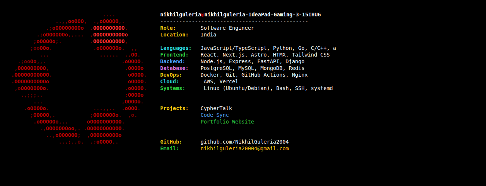

---

## 👋 About Me

I'm Nikhil, a Computer Science student and full-stack developer from India.

- 🐧 Ubuntu user
- ⚛️ Learning Astro + HTMX
- 🚀 Building full-stack web applications
- 💡 Interested in Linux, web development, and open source

---

## 🚀 Featured Projects

- **CypherTalk** – End-to-end encrypted chat application
- **Code Sync** – Collaborative online code editor
- **Portfolio Website** – Built with Astro + HTMX

---

## 📊 GitHub Stats

  
   
  

---

## 🌐 Connect

- GitHub: https://github.com/NikhilGuleria2004
