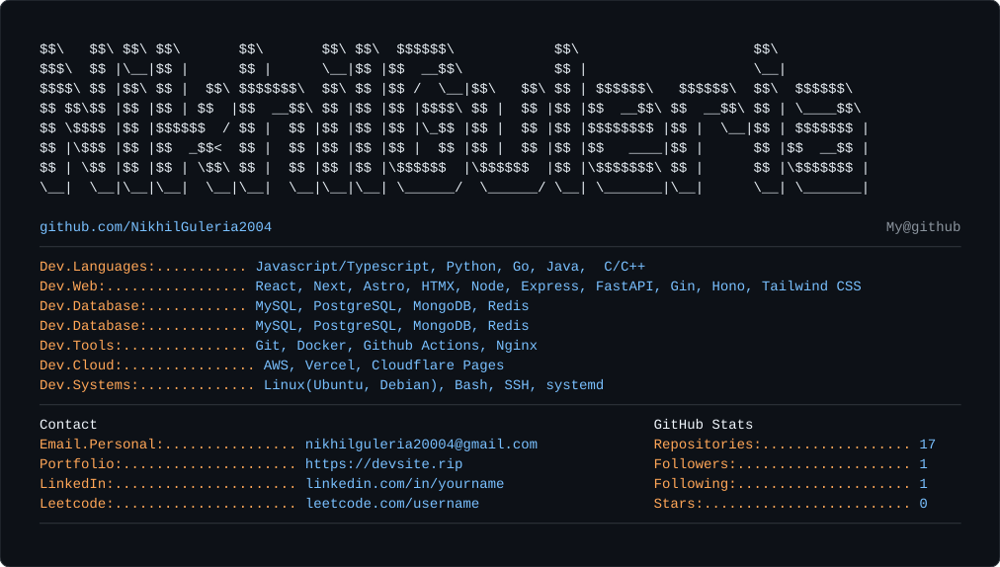

<!-- 

<pre>

$$\   $$\ $$\ $$\       $$\       $$\ $$\  $$$$$$\            $$\                     $$\           
$$$\  $$ |\__|$$ |      $$ |      \__|$$ |$$  __$$\           $$ |                    \__|          
$$$$\ $$ |$$\ $$ |  $$\ $$$$$$$\  $$\ $$ |$$ /  \__|$$\   $$\ $$ | $$$$$$\   $$$$$$\  $$\  $$$$$$\  
$$ $$\$$ |$$ |$$ | $$  |$$  __$$\ $$ |$$ |$$ |$$$$\ $$ |  $$ |$$ |$$  __$$\ $$  __$$\ $$ | \____$$\ 
$$ \$$$$ |$$ |$$$$$$  / $$ |  $$ |$$ |$$ |$$ |\_$$ |$$ |  $$ |$$ |$$$$$$$$ |$$ |  \__|$$ | $$$$$$$ |
$$ |\$$$ |$$ |$$  _$$<  $$ |  $$ |$$ |$$ |$$ |  $$ |$$ |  $$ |$$ |$$   ____|$$ |      $$ |$$  __$$ |
$$ | \$$ |$$ |$$ | \$$\ $$ |  $$ |$$ |$$ |\$$$$$$  |\$$$$$$  |$$ |\$$$$$$$\ $$ |      $$ |\$$$$$$$ |
\__|  \__|\__|\__|  \__|\__|  \__|\__|\__| \______/  \______/ \__| \_______|\__|      \__| \_______|
</pre>

                                                                                                    
<pre>
  
github.com/NikhilGuleria2004                                           My@github
───────────────────────────────────────────────────────────────────────────────────────────────────────────
Dev.Languages:........... Javascript/Typescript, Python, Go, Java,  C/C++
Dev.Web:................. React, Next, Astro, HTMX, Node, Express, FastAPI, Gin, Hono, Tailwind CSS
Dev.Database:............ MySQL, PostgreSQL, MongoDB, Redis
Dev.Database:............ MySQL, PostgreSQL, MongoDB, Redis
Dev.Tools:............... Git, Docker, Github Actions, Nginx
Dev.Cloud:............... AWS, Vercel, Cloudflare Pages
Dev.Systems:............. Linux(Ubuntu, Debian), Bash, SSH, systemd
<!--Hobbies.Software:.............. Minecraft Modding, Open Source
Hobbies.Hardware:.............. PC Building, Homelab
-->
<!--
──────────────────────────────────────────────────────────────────────────────────────────────────────────
Contact                                                                  GitHub Stats
Email.Personal:................ nikhilguleria20004@gmail.com             Repositories:.................. 17
Portfolio:..................... https://devsite.rip                      Followers:..................... 1
LinkedIn:...................... linkedin.com/in/yourname                 Following:..................... 1
Leetcode:...................... leetcode.com/username                    Stars:......................... 0

────────────────────────────────────────────────────────────────────────────────────────────────────────────
-->
<!--Learning:...................... Rust, Kubernetes 
Currently:..................... Building cool projects 
Uptime:........................ 22 Years 
IDE:........................... VS Code, IntelliJ IDEA   
Kernel:........................ Human v1.0 
Host:.......................... Your PC 
OS:............................ Windows 11 / Linux(UBUNTU, DEBIAN)
-->
<!--
</pre>

 -->
